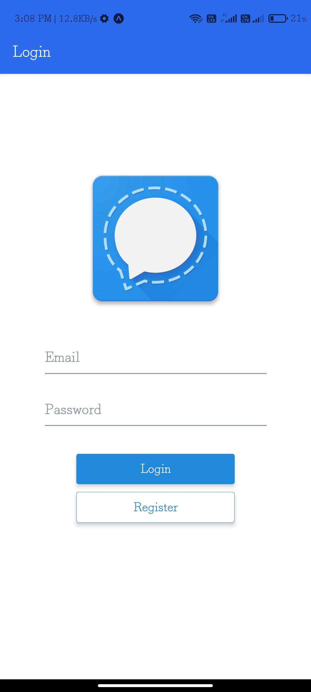
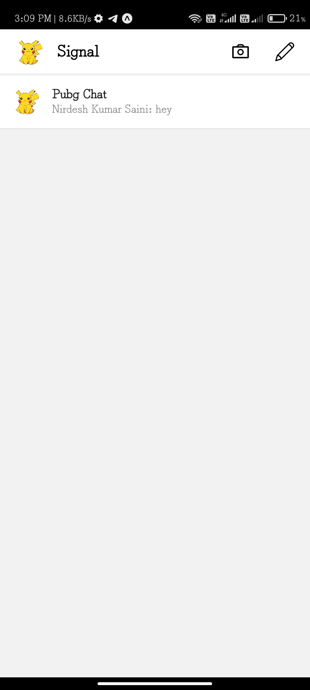
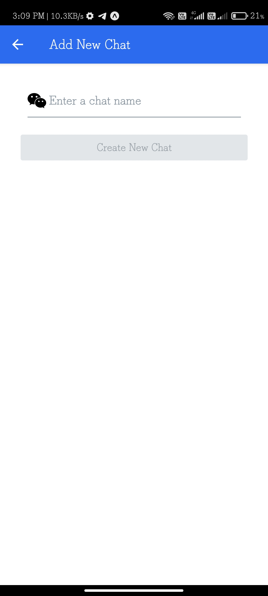

  
# signal-clone-chat-application
A real-time chat application used to learn Hybrid App development and enhanced skills. This Project is based on React-Native, Firebase, Expo-CLI.
You can deploy it for android, ios and also web by creating their respective build. I deployed it to web, So you can directly check on the web by clicking the link in about section.
If You want to check the project in your phone (android and ios both) ---
Download the Expo from Play Store (Andorid) and Apple Store (IOS)
Scan the QR Code through Expo app, installed in your device.
Hurrey! Project is opened in your phone.
# https://expo.io/@nirdeshkumar02/signal-clone-app
